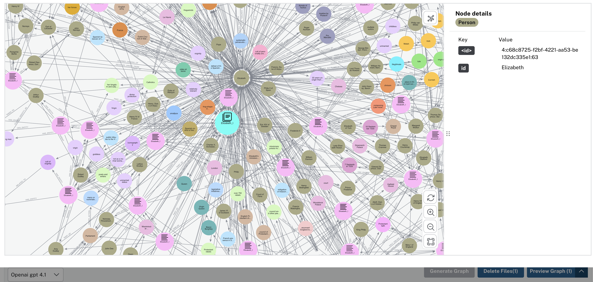

# neo4j-langchain-realtime-rag
This repository contains a real-time RAG (Retrieval-Augmented Generation) pipeline using Neo4j and LangChain. The pipeline is designed to process and query large datasets efficiently, leveraging the capabilities of graph databases.
## Features
- Real-time data ingestion and processing
- Integration with Neo4j for graph-based data storage
- Use of LangChain for natural language processing and querying
- Support for semantic search and knowledge graph creation
1. Semantic search with Neo4j and LangChain
2. Knowledge graph with Neo4j and LangChain
3. Keyword extraction with Neo4j and LangChain
## Overview
The pipeline consists of several key components:

1. **Data Ingestion**: Raw documents are ingested and processed to create graph documents.
2. **Graph Transformation**: The graph documents are transformed using an LLM (Large Language Model) to enhance their semantic representation.
3. **Querying**: Users can query the graph using natural language, and the system retrieves relevant information by traversing the graph.
4. **Response Generation**: The retrieved information is then used to generate responses, which can include text, visualizations, or other formats.

## Key Features
- **Real-time Processing**: The pipeline is designed to handle real-time data ingestion and querying
- **Graph Representation**: Utilizes Neo4j to represent data as a graph, allowing for complex relationships and efficient querying.

- **LLM Integration**: Integrates with LLMs to enhance the semantic understanding of the data.
- **Flexible Querying**: Supports natural language queries, making it user-friendly and accessible.


## Example Usage
The following example demonstrates how to create and query a simple social network graph using Cypher queries in Neo4j:
```markdown
**Nodes and Relationships**
1. **Users:** Represented as nodes with properties like name and age.
2. **Posts:** Created by users.
3. **Relationships:** Friendships between users and "likes" on posts.

**Cypher Queries to Create and Query the Graph**
**Creating Nodes**
```cypher
CREATE (alice:User {name: 'Alice', age: 30})
CREATE (bob:User {name: 'Bob', age: 25})
CREATE (post1:Post {content: 'Hello, world!', timestamp: 1625251200})
CREATE (post2:Post {content: 'Graph databases are great!', timestamp: 1625337600})
CREATE (alice)-[:FRIENDS_WITH]->(bob)
CREATE (alice)-[:LIKES]->(post1)
CREATE (bob)-[:LIKES]->(post2)
```
**Querying the Graph**
```cypher
MATCH (u:User)-[:LIKES]->(p:Post)
RETURN u.name, p.content
```
This example demonstrates how to create nodes for users and posts, establish relationships, and query the graph to retrieve information about users and their liked posts.
```
## Installation
To set up the environment, follow these steps:
1. Clone the repository:
   ```bash
   git clone https://github.com/yourusername/neo4j-langchain-realtime-rag.git
   ```
2. Navigate to the project directory:
   ```bash
   cd neo4j-langchain-realtime-rag
    ```
3. Install the required dependencies:
    ```bash
   pip install -r requirements.txt
    ```
4. Set up Neo4j and LangChain configurations as per your environment.
5. Start the Neo4j server and ensure it is running.
6. Run the pipeline script to start processing data:
   ```bash
   python neo4j_rag_pipeline.py
   ```

## Contributing
Contributions are welcome! If you have suggestions for improvements or new features, please open an issue or submit a pull request. When contributing, please ensure that your code adheres to the project's coding standards and includes appropriate tests.

## License
This project is licensed under the MIT License. See the [LICENSE](LICENSE) file for details.